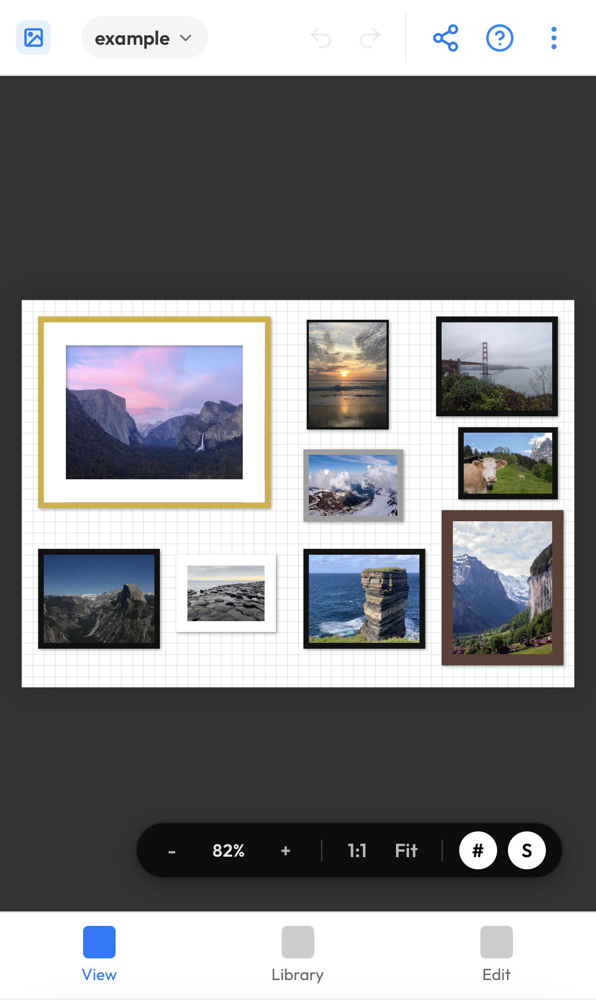

# GalleryPlanner 🖼️✨

**Visualize your perfect gallery wall before you hang a single nail.**

A powerful, interactive web application designed to help you plan complex gallery layouts with real frames and personal photos. Transition from a pile of frames on the floor to a perfectly aligned wall with confidence.

---

## 🚀 Key Highlights

*   **Precision Layout Canvas**: An infinite workspace with pan, zoom, and smart snapping tools (`S`, `#`) for pixel-perfect alignment.
*   **Staircase Wall Support**: Design for staircase walls with configurable rise (10-100%) to match your exact slope.
*   **Instant Visualization**: Drag and drop photos from your computer directly onto frames to see your memories in situ.
*   **Portable Project Bundles**: Save your entire workspace—including photos—into a single `.gwall` file for easy sharing or backup.
*   **Print-Ready Photo Export**: preparing your gallery for reality? Export all your cropped photos in a high-resolution ZIP (with smart DPI capping), ready for professional printing.
*   **Intelligent Search & Filter**: Instantly find frames by label or size (e.g., "8x10") and photos by filename. Filter collections by shape or status.
*   **Inventory First Workflow**: Keep track of your physical frames. Even if you remove a frame from the wall, it stays in your "Unplaced" library for later use.

## 📱 Mobile Experience

**Plan, measure, and visualize anywhere.** The GalleryPlanner is now available in your pocket.

  

*   **Touch-Optimized Toolset**: A carefully selected set of core features—including custom frame creation and smart snapping—optimized for a native mobile feel.
*   **Seamless Handoff**: Start a design on the couch, export the `.gwall` bundle, and finish on your desktop.
*   **Pocket Reference**: Keep your wall dimensions and layout accessible anywhere for quick checks or visualizing new ideas.
*   **Touch-Native UI**: A responsive interface that adapts with bottom-sheet navigation and touch-friendly controls.

---

## 🛠️ Detailed Features

### 🖼️ Inventory & Frame Management
*   **Adaptive Grid Inventory**: A smart sidebar that shifts between list and grid views, featuring "Placed" status overlays on frame previews.
*   **1:1 Inventory Manifest**: Every frame is accounted for individually with "Placed" and "(Duplicated)" indicators.
*   **Smart Parsing & Import**: Batch import dimensions from plain text (e.g., "8x10", "11 1/4 x 14 matted"). Handles fractions and keywords automatically.
*   **Custom Labels & Scaling**: Name your frames (e.g., "Light Switch") directly. Labels automatically scale to fit their container for maximum readability.
*   **Geometric Variety**: Full support for traditional rectangles and modern round/oval shapes with automatic proportional scaling.
*   **Aesthetics**: Set frame colors using presets or a color picker; toggle and adjust matting openings on the fly.
*   **Direct Dimension Control**: Resize frames directly in a tabbed **Properties Panel**; changes update the wall and inventory dynamically.
*   **Additive Layout Logic**: Adding borders or mats grows the frame *outward*, ensuring your internal photo dimensions remain exactly as intended.

### 📸 Photo Management
*   **Masonry Library**: A beautiful, efficient grid for managing your uploaded photos.
*   **Smart Integration**: Drag files directly from your computer onto a canvas frame to place them and auto-save them to your library.
*   **Photo Fine-Tuning**: Dedicated adjustment tab for scale, position, and 90° rotation within the frame.
*   **Search**: Find photos by filename instantly as your library grows.

### 🎨 Workspace Interaction
*   **Modern Glass HUD**: Sleek, translucent on-canvas controls for zoom, grid toggles, and snapping that maximize workspace visibility.
*   **Marquee Selection**: Bulk-select, nudge, or duplicate clusters of frames by dragging on the background.
*   **Context Menu**: Right-click for layering (Bring to Front), duplication, and photo removal.
*   **Advanced Alignment**: Use **Lucide-React** standard icons to align frames by edges or centers.
*   **Undo / Redo**: Full session history support via `Ctrl+Z` / `Ctrl+Y`.
*   **Automatic Persistence**: Your progress is instantly saved to local storage—refresh or return later exactly where you left off.

### 💾 Project Controls
*   **Shopping List**: Export a text manifest of all frames in your design for easy shopping.
*   **Canvas Snapshot**: Save your layout as a PNG to share or use as a reference.
*   **Multi-Project Support**: Create and switch between distinct gallery wall designs.

### 🧠 Smart Layout Engine
*   **AI-Assisted Arrangements**: Stuck on design? Let the engine propose layouts for you based on your selected frames.
*   **Multiple Generators**: Choose from 5 distinct algorithms:
    *   **Masonry**: Tightly packed, organic grid perfect for mixed sizes.
    *   **Grid**: Strict alignment for uniform collections.
    *   **Skyline**: Bottom-aligned "cityscape" look, great for shelves or mantels.
    *   **Spiral**: Artistic, center-outward spiral flow.
    *   **Monte Carlo**: Randomized exploration for finding happy accidents.
*   **Fine-Tuning Controls**: Adjust spacing, randomness, and uniformity to dial in the perfect look.
*   **Non-Destructive**: Generates suggestions on a virtual canvas—apply only when you're happy.

---

## ⌨️ Shortcuts & Navigation

Click the **"?"** button in the header for the in-app **Quick Start Guide**.

| Category | Shortcut | Action |
| :--- | :--- | :--- |
| **View** | `Right-Click + Drag` | Pan Workspace |
| | `Ctrl / Cmd + Scroll` | Zoom In/Out |
| | `#` | Toggle Background Grid |
| | `S` | Toggle Snap-to-Grid |
| **Selection** | `Ctrl / Cmd + A` | Select All (Frames or Photos) |
| | `Click + Drag` | Marquee selection |
| **Edit** | `Ctrl / Cmd + D` | Duplicate Selection |
| | `Ctrl + Drag` | Quick Duplicate and Move |
| | `Arrows` | Nudge 1px (`Shift` for 10px) |
| | `Backspace / Del` | Remove Selection |
| | `Double-Click` | Reset image scale/position in frame |
| **History** | `Ctrl + Z` | Undo |
| | `Ctrl + Y` | Redo |

---

## 🏗️ Getting Started

1.  **Install**: `npm install`
2.  **Dev Server**: `npm run dev`
3.  **Browse**: Open `http://localhost:5173`.

> [!TIP]
> First-time users can load a demo gallery wall from the welcome screen or anytime via the Help menu (**?**). You can also check [example_frame_template.txt](./example_frame_template.txt) to see how to format your own frame collection for batch importing.

**Tech Stack**: Built with React 19 (Vite), **TypeScript**, CSS Modules, and IndexedDB for persistent local storage.

v2.2.1 Released Feb 2026. 🚀✨

© 2026 Timothy Straub. All Rights Reserved.
