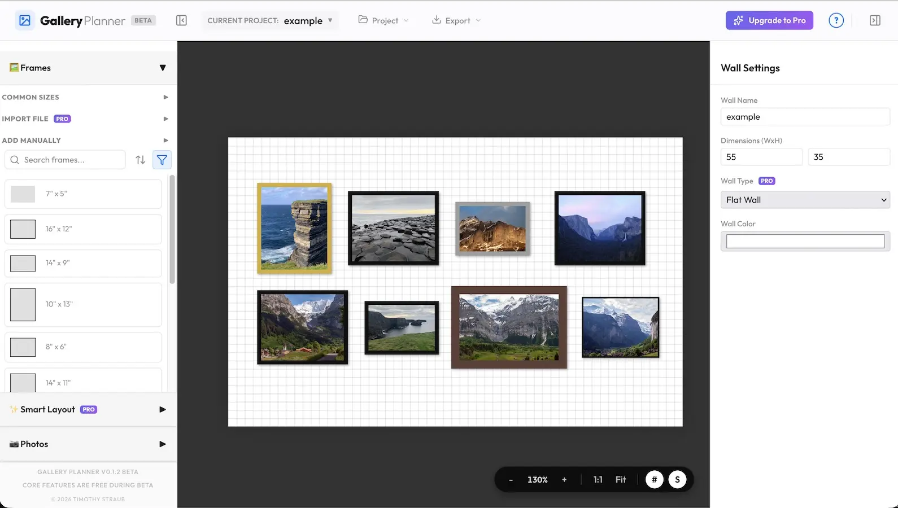
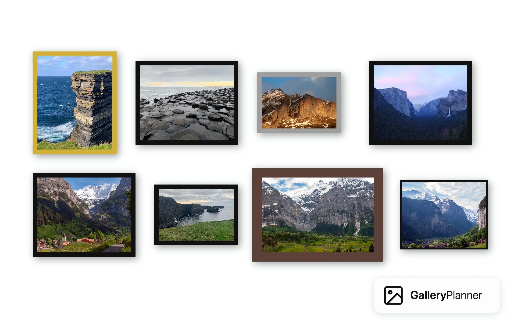
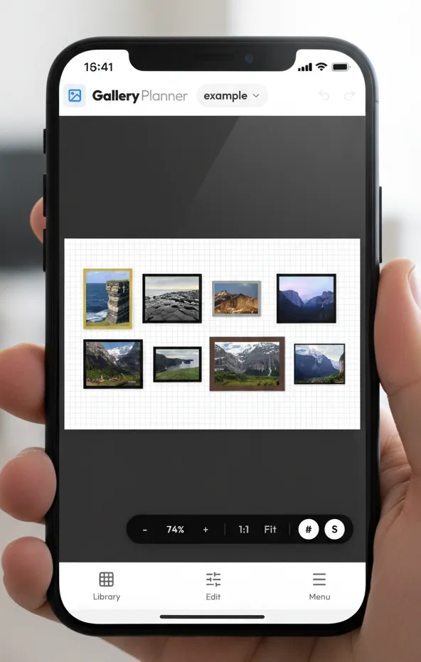

# GalleryPlanner 🖼️✨

**Visualize your perfect gallery wall before you hang a single nail.**

**🎨 Live App:** [gallery-planner.com](https://gallery-planner.com)



> [!IMPORTANT]
> **GalleryPlanner is currently in Early Beta.** During this period, all **PRO features** (AI Auto-Layout, PDF Guides, Project Exports, etc.) are **completely free** to use while I refine the experience.

A powerful, interactive web application designed to help you plan complex gallery layouts with real frames and personal photos. Transition from a pile of frames on the floor to a perfectly aligned wall with confidence.

### 🔒 Local-First & Privacy Focused
GalleryPlanner runs entirely in your browser.
*   **No Cloud Uploads**: Your personal photos and frame inventory never leave your device.
*   **Offline Capable**: Works without an internet connection once loaded.
*   **Private**: Your home data stays in your home.

---

### Create designs, then export snapshots:


---

<a href="https://www.buymeacoffee.com/tstraub89" target="_blank"></a>

---

## 🚀 Key Highlights
*   **AI Smart Fill [PRO]**: Automatically populate your frames with the best photos from your library. Our local AI analyzes composition, color harmony, and faces to create the perfect arrangement in seconds.
*   **✨ Playground Mode**: Experience the full power of GalleryPlanner Pro for free! Load the **Example Gallery** to unlock all premium features (Smart Fill, PDF Export, etc.) in a sandbox environment.
*   **AI-Assisted Auto-Layout [PRO]**: Stuck on design? Let our smart engine propose layouts (Masonry, Grid, Skyline, etc.) based on your selected frames.
*   **Instant Visualization**: Drag and drop photos from your computer directly onto frames to see your memories in situ.
*   **Hanging Guide (PDF) [PRO]**: Export a professional, ready-to-print installation guide featuring your layout snapshot and precise measurements for hanging your frames in the real world.
*   **Portable Project Bundles [PRO]**: Save your entire workspace—including photos and AI analysis data—into a single `.gwall` file for easy sharing or backup.
*   **Staircase Wall Support [PRO]**: Design for staircase walls with configurable rise (10-100%) to match your exact slope.
*   **Precision Layout Canvas**: An infinite workspace with pan, zoom, and smart snapping tools (`S`, `#`) for pixel-perfect alignment.
*   **Inventory First Workflow**: Keep track of your physical frames. Even if you remove a frame from the wall, it stays in your "Unplaced" library for later use.
*   **Print-Ready Photo Export [PRO]**: Preparing your gallery for reality? Export all your cropped photos in a high-resolution ZIP (with smart DPI capping), ready for professional printing.
*   **Designer Shapes [PRO]**: Go beyond the basics with circular and oval frame support for unique gallery looks.
*   **Intelligent Search & Filter**: Instantly find frames by label or size (e.g., "8x10") and photos by filename. Filter collections by shape or status.

## 📱 Mobile Experience

**Plan, measure, and visualize anywhere.** The GalleryPlanner is now available in your pocket.

<p align="center">
  
</p>

*   **Touch-Optimized Toolset**: A carefully selected set of core features—including custom frame creation and smart snapping—optimized for a native mobile feel.
*   **Seamless Handoff**: Start a design on the couch, export the `.gwall` bundle, and finish on your desktop.
*   **Pocket Reference**: Keep your wall dimensions and layout accessible anywhere for quick checks or visualizing new ideas.
*   **Touch-Native UI**: A responsive interface that adapts with bottom-sheet navigation and touch-friendly controls.

---

---

## 📚 Documentation

For a deep dive into feature guides, "how-to" videos, and advanced shortcuts, check out the live structure:
*   [**Help Center & Manual**](https://gallery-planner.com/help)
*   [Privacy Policy](https://gallery-planner.com/privacy)

---

## 🏗️ Getting Started

1.  **Install**: `npm install`
2.  **Dev Server**: `npm run dev`
3.  **Browse**: Open `http://localhost:5173`.

### 🏗️ Build & Prerender (SEO)
For production, the site uses a custom Static Site Generation (SSG) pipeline to ensure all content (Landing, Help, Design Guides) is fully readable by bots and scrapers:
```bash
npm run build
```
This command generates the sitemap, RSS feed, builds the SPA, and then prerenders all static routes into HTML files in the `dist/` directory using Vite's SSR API.

> [!TIP]
> First-time users can load a demo gallery wall from the welcome screen or anytime via the Help menu (**?**). You can also check [example_frame_template.txt](./example_frame_template.txt) to see how to format your own frame collection for **batch importing [PRO]**.

**Tech Stack**: Built with React 19 (Vite), **TypeScript**, CSS Modules, and IndexedDB for persistent local storage.

© 2026 Timothy Straub. All Rights Reserved.
